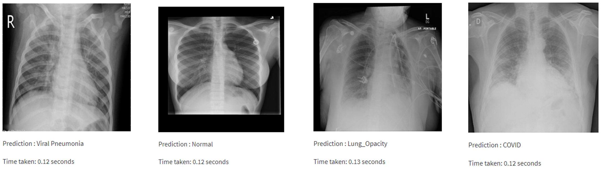
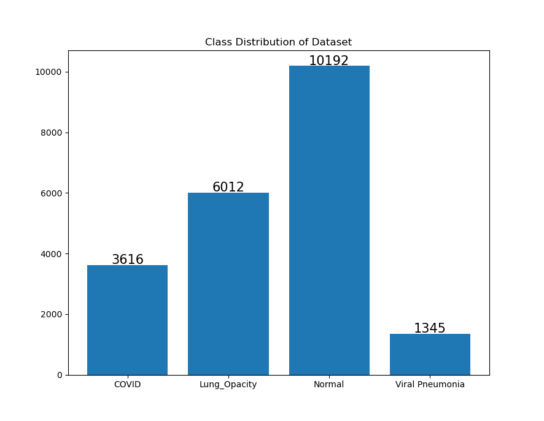

# Image Processing Assignment - X-Ray Disease Classification
## Example Output

## Dataset
[COVID-19 Radiography Database (Kaggle)](https://www.kaggle.com/tawsifurrahman/covid19-radiography-database)

